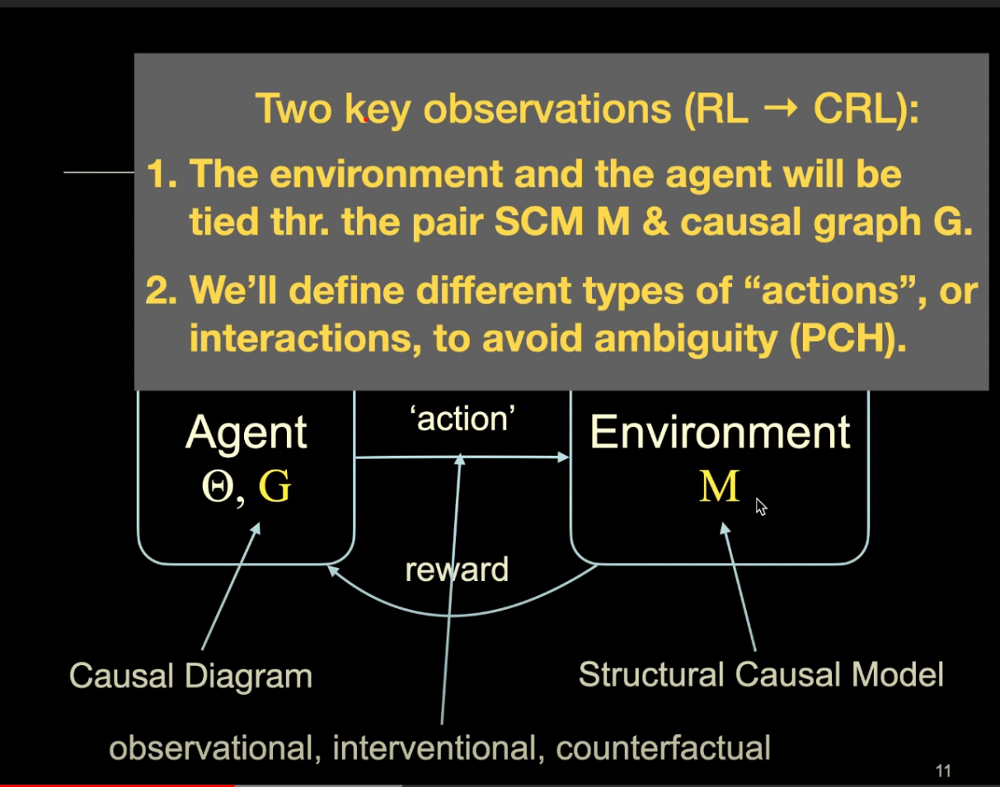
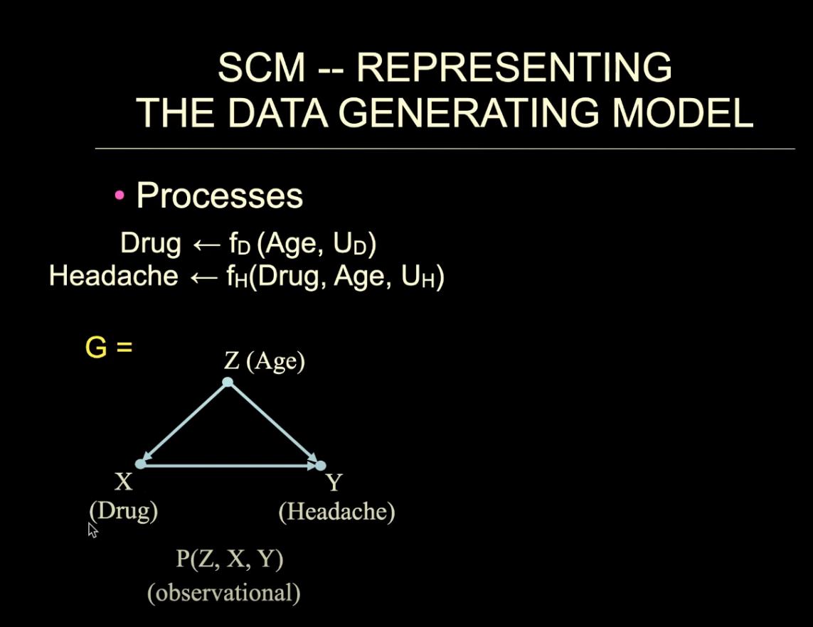

# introduction to CRL
## part1
  - RL -> CRL

  - (structural causal model)   SCM 
  
  - inverse probability weighting (IPW)

Causal inference
- if Y is a child of X, then X is the direct cause of Y
- if Y is the descendent of X, the X is a potential cause of Y

# Actor-critic
## value-based methods
  - Use neural net $q(s,a;\omega)$ to approximate $Q_{\pi}(s,a)$
  - $\omega$ is the trainable parameters of the neural net
  - input: state s and action a
  - approximate action-value (scalar)
## Policy-based methods
  - Use neural net $\pi(a|s;\theta)$ to approximate $\pi(a|s)$
  - $\theta$ is the trainable parameters of the neural net
  - input: state s
  - output: probability distributions over the actions
## Network training
- observe state $s_t$
- Randomly sample action $a_t$ according to $\pi(\cdot|s_t;\theta_t)$
- perform $a_t$ and observe new state $s_{t+1}$ and reward $r_t$
- update value network q use TD
  -compute $ 
- update policy network $\pi$ using policy gradient
  - policy gradient: derivative of $V(s_t;\theta,\omega)$ w.r.t. $\theta$. 
    - let $g(a,\theta) = \frac{\partial log~{\pi(a|s,\theta)}}{\partial \theta}\cdot q(s_t,a;\omega)$
    - $\frac{\partial V(s_t;\theta,\omega_t)}{\partial \theta} = \mathbb{E}_A{[g(A,\theta)]}$
  - random sampling: $a \sim \pi(\cdot|s_t;\theta_t)$
  - stochastic gradient ascent: $\theta_{t+1}=\theta_t+\beta\cdot g(a,\theta_t)$
- 
# Paper
confounded components (c-component), assign two variables to the same group iff they are connected by a path composed solely of bi-directional arrows.